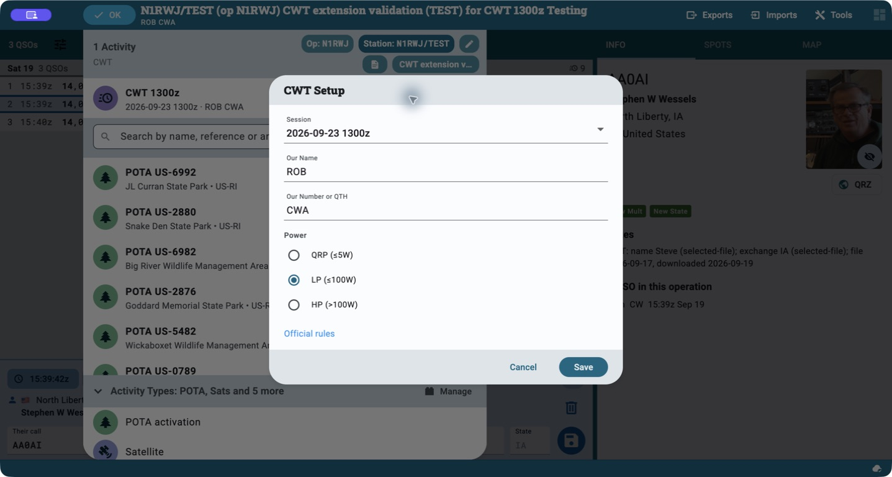
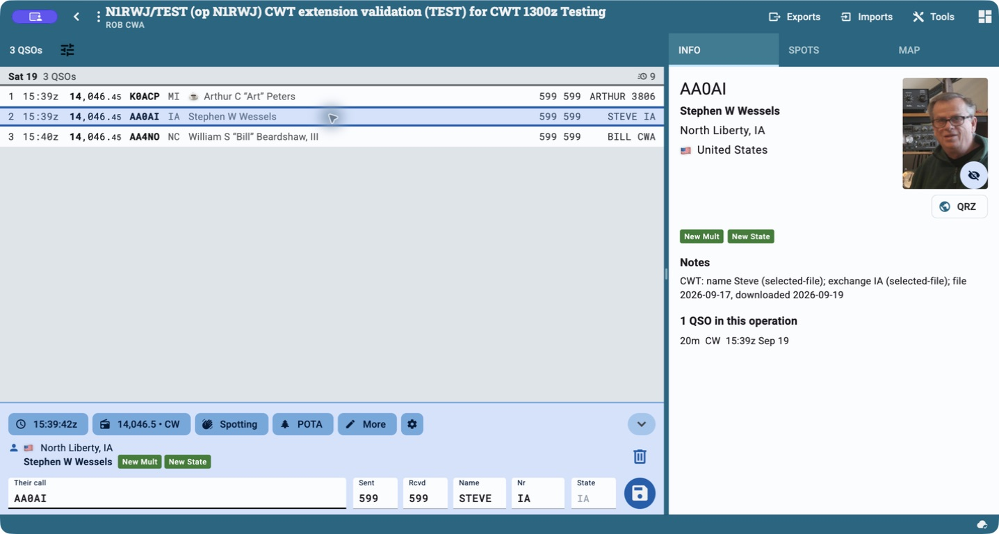

# CWops CWT for Ham2K

Log the **CWops Tests (CWT)** in Ham2K with session selection, exchange
suggestions, scoring, and ADIF/Cabrillo exports. The extension suggests names
and CWops numbers or locations from a downloaded call-history file and your
previous CWT contacts, while preserving what you actually enter. Its extension
key is `ham2k-cwt`, and operations and contacts use `cwt` references.

## The contest at a glance

[CWops CWT](https://cwops.org/cwops-tests/) welcomes members and nonmembers.
Each one-hour session is a separate event.

| Detail | CWT |
| --- | --- |
| Sessions, UTC | Wednesday 13:00 and 19:00; Thursday 03:00 and 07:00 |
| Mode and bands | CW on 160, 80, 40, 20, 15, and 10 meters |
| Exchange | First name + CWops member number; nonmembers send state, province, or DX country prefix |
| Example | `ART 3806` for a member, or `ROB RI` for a nonmember in Rhode Island |
| Score | QSO points × unique callsigns across all bands |

Eligible CW Academy participants can use `CWA` as described in the
[official rules](https://cwops.org/cwops-tests/). A CWops number is a fixed
membership number: **CWT does not use a sequential contact serial number**.
The extension suggests the regular weekly schedule; check the sponsor's
calendar for special sessions or schedule changes.

## Get started

1. Enable one CWops CWT extension in Ham2K. Keep only one CWT extension active
   so the operation has one set of exchange controls and scoring rules. See
   the [repository guide](../../../README.md) for availability and the
   `ham2k-` installation restrictions.
2. Create an operation for the session, add CWT, and select its UTC date/time.
   Set your sent first name, member number or location (or eligible `CWA`
   exchange), and power class.
3. Under **Settings → Accounts, Services & Data Sources**, refresh
   **CWops CWT call history** before operating. Earlier app builds call this
   area **Data Files**.
4. Enter a callsign, listen to the exchange, and confirm or correct the
   suggested **Name** and **Nr** values before saving.

Use a separate operation for each session and log **one callsign at a time**;
batch call entry shares exchange fields. Use **Wipe** to begin a fresh contact
and reset any edits left in the controls.

## In Ham2K

Open the operation title, then **Edit activity** beside CWT to choose the
UTC session, your sent name/number or location, and power class.



The logging view adds **Name** and **Nr** beside the normal contact fields.
Here the selected test contact has `STEVE IA`; the log also shows a member
number and a `CWA` exchange. The **Info** pane identifies the call-history
source, and the log header shows the score.



These native macOS screenshots were captured September 21, 2026 in published
Ham2K Next 26.9.0 build 170, using the personal `n1rwj-cwt` 0.3.1 adaptation
in a 1437×768 window. The **Testing** operation contains synthetic contacts;
the dates and exchanges shown are examples. They illustrate the shared CWT
UI using the published GitHub bundle, not installation of the reserved
`ham2k-cwt` package. No contacts or session settings were changed for capture.

## Where the call history comes from

The default source is the public
[N1MM call-history collection](https://n1mmwp.hamdocs.com/mmfiles/categories/callhistory/).
The extension discovers the latest listed `CWOPS_*.txt` entry and submits its
current download form. No dated filename or download token is pinned. These
community-maintained files supply suggestions, not a live membership check
or a guarantee of today's exchange. See N1MM's
[call-history explanation](https://n1mmwp.hamdocs.com/setup/call-history/).

Ham2K checks data-file freshness when it loads the extension and when it
reconnects, downloading a missing file or refreshing one older than 24 hours.
The one-day setting is a freshness threshold checked at those times, not a
timer that runs exactly once every 24 hours. You can also refresh manually.
**CWT Prefill** settings show the source, file date, download time, record
count, and warnings. Leave the source blank for automatic discovery, or select
an HTTPS entry or direct text URL on `n1mm.hamdocs.com` or
`n1mmwp.hamdocs.com`; refresh after changing the source. Local file paths are
not supported.

Typing a callsign uses downloaded data and local history; it does not download
the file for every contact. Failed refreshes leave the last valid snapshot
available. The native data-file manager persists that snapshot for offline
use and replays it when the app starts. Runtime KV is only a secondary
in-memory cache, not the durable storage mechanism.

## Precedence and corrections

Name and number are resolved independently, in this order:

1. The operator's input, including an intentionally cleared field.
2. Explicit exchanges from earlier QSOs in the current operation.
3. The selected CWOPS file.
4. Explicit exchanges from older CWT QSOs in the host's callsign history.

History queries request `{ refType: 'cwt' }` before the host applies its
five-contact limit, so newer contacts in other activities cannot hide older
CWT exchanges. Each portable call and its base call receive the same filter.
Older Ham2K builds ignore it; the extension still rejects unrelated contacts,
but can only use CWT contacts among the latest five returned for each call.

If these sources provide no exchange, Number/QTH prefills from the station’s
state, then its country/entity prefix (including callsign country-file lookup).
The name can fall back to Ham2K’s ordinary name suggestion. Check location
guesses against what was received: they are saved unless changed or cleared.
When no location is available, previous untouched suggestions are cleared.

The native controls own the first step: suggestions only update untouched
fields. A previously guessed ref value is not evidence of operator input.
The save hook records the controls' accepted values; it does not look up a
replacement exchange during save. The currently edited QSO is excluded from
history suggestions.

Within each source, exact calls match before portable base calls. A base-call
match may supply a name, member number, or CWA exchange, but never a
nonmember's location: a portable station might be somewhere else. A location fallback uses the
current callsign’s lookup data; an absent member number remains unknown.
Neither a guessed state nor free-text notes establish nonmembership.

Lookup notes identify known history/file suggestions and the data file’s
freshness; they do not report the location fallback.

## How scoring works

Each eligible contact earns **one point**, and a callsign can count once on
each contest band. Multipliers count **different callsigns across the entire
session**. Working the same station on another band adds a point, but no new
multiplier. For example, 10 contacts with 8 different callsigns score
**10 × 8 = 80**.

Same-band duplicates, non-CW contacts, and contacts on other bands earn no
points. The current CWT scorer does **not** independently exclude contacts
outside the selected hour or reject incomplete exchanges. Keep the operation
confined to its session and review the exchange fields before reporting; a
displayed score is not a completed-log check.

## Export and report your score

Use Ham2K's **Exports** menu for ADIF or Cabrillo. The files use the
`CWOPS-CWT` contest identifier and retain your sent and received exchanges.
Report each session's total at [3830 Scores](https://www.3830scores.com/),
following the [CWops reporting instructions](https://cwops.org/cwops-tests/).
CWops requests score reports within 48 hours for participation credit;
routine CWT participation does not require a log submission.

## Supported call-history data

The parser follows the [N1MM call-history format](https://n1mmwp.hamdocs.com/setup/call-history/):
comma or semicolon delimiters, quoted fields, `!!Order!!`, comment and contest
association lines, and `# LastEdit,YYYY-MM-DD` dates. Missing columns remain missing.
Duplicate calls merge nonempty fields deterministically. `Name` and `Exch1`
provide the CWT exchange; `State`, `Sect`, and `UserText` are not substitutes
for an absent `Exch1`. Unsupported directives, incompatible contest
associations, invalid exchanges, and malformed rows reject a refresh. Extra
trailing columns are reported as warnings. Files are limited to 5 MB of text.

No data download happens while entering a callsign. Scoring snapshots index
current-operation history. On hosts that omit the operation UUID from lookup
arguments, the adapter recovers it only from an unambiguous scoring snapshot
with the same creation timestamp and station call. A full-log read is shared
and cached when needed to reconcile the host's capped callsign history;
ordinary lookups use targeted callsign reads. The current host returns at most
five recent matches per exact/base call, so older CWT history outside that
window may be unavailable.

## Verification

From the repository root:

```sh
npm test -w @ham2k/ext-cwt
npm run typecheck
npm test
npm run pack -w @ham2k/ext-cwt
```

Tests cover parsing, field precedence, portable calls, offline cache replay,
failed refreshes and races, edited/deleted history, native-shaped operation
arguments, and the registered controls through saved/exported exchanges.
The repository's bundle test builds, validates, packs, and loads every
extension against a stub kernel. These are automated checks, not a native
Ham2K UI test. See the root README for the reserved `ham2k-` installation rule:
hand testing requires a temporary personal key or catalog distribution.

The prefill modules were developed by Robert Jackson, N1RWJ, and contributed
under this repository's MIT license. Sebastian Delmont's existing CWT code
and copyright remain intact.

## Spots

See [RBN spots](SPOTS.md) for the native Spots source and its default call-history filter.
